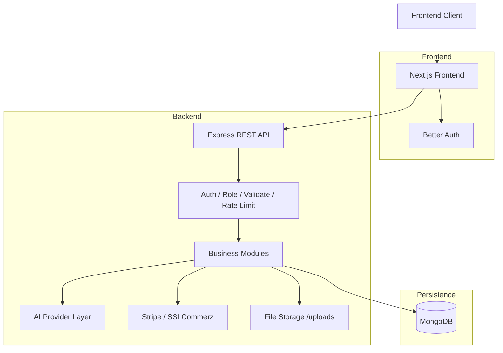
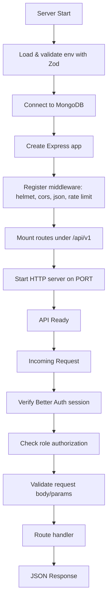
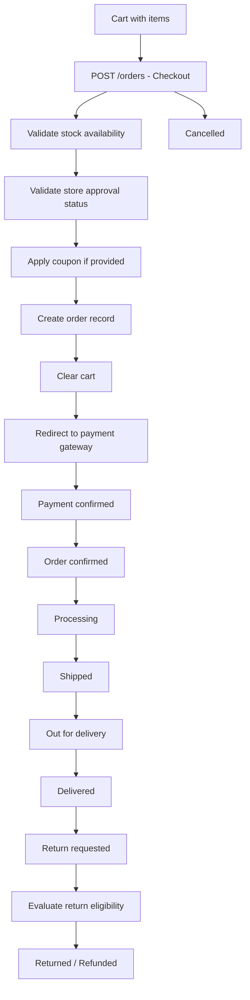
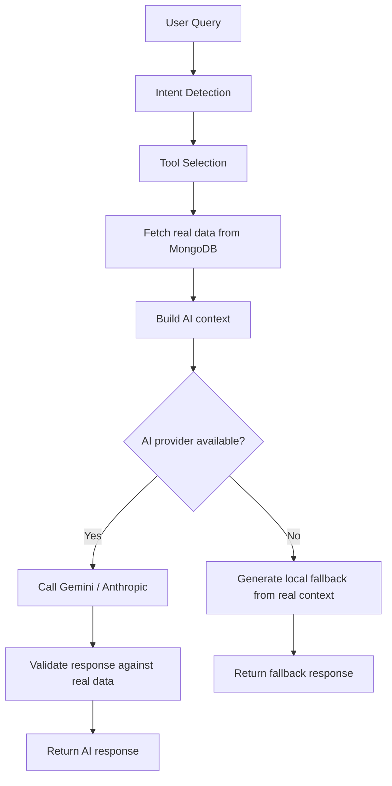

<p align="center">
  
</p>

<p align="center">
  <a href="https://readme-typing-svg.demolab.com">
    
  </a>
</p>

<p align="center">
  
  
  
  
  
  
</p>

**AI-Powered Multi-Vendor Commerce & Seller Platform — Backend API**

> A production-oriented Express/TypeScript backend powering marketplace commerce, seller management, AI-assisted shopping, seller intelligence, administration, security, analytics, and complete order workflows.

---

## Table of Contents

1. [Project Overview](#project-overview)
2. [Backend Responsibilities](#backend-responsibilities)
3. [User Roles](#user-roles)
4. [Core Features](#core-features)
5. [System Architecture](#system-architecture)
6. [Technology Stack](#technology-stack)
7. [Project Structure](#project-structure)
8. [Application Flow](#application-flow)
9. [Authentication](#authentication)
10. [Authorization](#authorization)
11. [API Architecture](#api-architecture)
12. [Database Architecture](#database-architecture)
13. [Commerce Modules](#commerce-modules)
14. [Customer Modules](#customer-modules)
15. [Seller Modules](#seller-modules)
16. [Admin Modules](#admin-modules)
17. [AI Architecture](#ai-architecture)
18. [AI Provider System](#ai-provider-system)
19. [AI Copilot Architecture](#ai-copilot-architecture)
20. [AI Advisor](#ai-advisor)
21. [AI Product Finder](#ai-product-finder)
22. [AI Seller Intelligence](#ai-seller-intelligence)
23. [Security](#security)
24. [Validation](#validation)
25. [Error Handling](#error-handling)
26. [Payments](#payments)
27. [Orders](#orders)
28. [Notifications](#notifications)
29. [Analytics](#analytics)
30. [Environment Variables](#environment-variables)
31. [Local Development](#local-development)
32. [API Usage](#api-usage)
33. [Testing](#testing)
34. [Build](#build)
35. [Deployment](#deployment)
36. [Git Workflow](#git-workflow)
37. [Performance](#performance)
38. [Scalability](#scalability)
39. [Troubleshooting](#troubleshooting)
40. [Development Guidelines](#development-guidelines)
41. [Project Status](#project-status)
42. [Future Roadmap](#future-roadmap)
43. [License](#license)

---

## Project Overview

ShopNest is a full-featured multi-vendor commerce platform. The backend is the central system that powers the entire marketplace, connecting the Next.js frontend to MongoDB and external services.

### What ShopNest Backend Does

The backend is responsible for every server-side operation in the platform:

- **Identity & Access:** Authentication via Better Auth (shared with frontend), role-based authorization (Customer, Seller, Admin)
- **Commerce Core:** Products, categories, cart, wishlist, orders, payments, reviews, coupons
- **Seller Operations:** Store registration, product management, inventory, order fulfillment, analytics
- **Customer Features:** Order history, spending analytics, shopping goals, product lifecycle tracking, AI assistance
- **Administration:** User management, seller moderation, product moderation, platform analytics, security oversight
- **AI Services:** AI shopping advisor, customer/seller/admin copilots, product finder, visual search, review intelligence, pricing suggestions, product description generation
- **Security & Trust:** Audit logs, security incidents, fraud flags, trust scores, device session tracking
- **Notifications:** Real-time notifications for orders, reviews, store events

### How It Differs from a Basic E-Commerce API

Unlike a standard e-commerce backend, ShopNest integrates AI throughout the commerce flow:

- **AI Shopping Advisor** understands natural language queries and returns ranked, explainable product recommendations
- **AI Copilots** provide role-aware conversational assistance (customer shopping, seller business intelligence, admin marketplace oversight)
- **AI Product Finder** researches products across the web, verifies sources, and generates listings
- **Review Intelligence** summarizes customer sentiment automatically
- **Visual Search** describes uploaded images and matches them to catalog products

The backend also implements a **trust scoring system** for sellers, **security incident tracking**, **return eligibility logic**, and **comprehensive seller/customer analytics** — all backed by real MongoDB data.

### Architecture Decision: Shared Identity

**This backend does not own user identity.** The frontend uses [`better-auth`](https://www.auth.js.dev) with a MongoDB adapter. The backend reads the same MongoDB database, verifies the session cookie's HMAC signature using `BETTER_AUTH_SECRET`, and looks up the session in better-auth's own `session`/`user` collections. This means:

- `MONGODB_URI` must match between frontend and backend
- `BETTER_AUTH_SECRET` must match between frontend and backend
- The backend attaches `req.user = { id, email, name, role, image }` for downstream handlers
- The frontend must configure better-auth with a `role` additional field on the user model for role-based routes to work

---

## Backend Responsibilities

| Responsibility | Description |
|---|---|
| **Authentication** | Session verification via Better Auth cookies; no password hashing here |
| **Authorization** | Role-based access control (customer, seller, admin) |
| **Products** | Catalog management, search, filtering, moderation, AI-powered tools |
| **Categories** | Category CRUD, admin-only writes, public reads |
| **Cart** | Per-user cart with stock-checked add/update/remove |
| **Wishlist** | Per-user saved items |
| **Orders** | Complete order lifecycle from cart to delivery/return/refund |
| **Payments** | Stripe and SSLCommerz integration for online payments |
| **Reviews** | Product reviews with verified-purchase detection and admin moderation |
| **Coupons** | Percentage/fixed coupons with validation at checkout |
| **Sellers** | Store registration, profile, metrics, onboarding |
| **Trust** | Explainable 0–100 seller trust score based on fulfillment, ratings, disputes, account age |
| **Security** | Audit logs, fraud detection, device session management, incident tracking |
| **Admin** | Platform-wide dashboard, seller approval, product moderation, user management |
| **AI** | Shopping assistant, copilots (customer/seller/admin), product finder, visual search, review intelligence, pricing suggestions |
| **Customer Features** | Spending analytics, shopping goals, product lifecycle, AI features |
| **Notifications** | In-app notifications for orders, reviews, store events |
| **Returns** | Return eligibility evaluation and evidence collection |
| **Risk** | Order risk assessment |
| **Support** | Support ticket management |

---

## User Roles

The backend enforces three distinct roles. All role checks happen server-side based on `req.user.role` derived from the Better Auth session.

### Customer

Customers are buyers in the marketplace. They can:

- Browse and search products
- Manage cart and wishlist
- Place orders and make payments
- Submit reviews
- Apply coupons
- Track orders and request returns
- Access AI shopping advisor and customer copilot
- View spending analytics and shopping goals
- Manage profile and addresses

### Seller

Sellers operate storefronts. They can:

- Register and manage a store
- Create, update, and moderate products
- Manage inventory and stock
- Fulfill and track orders
- Create and manage coupons
- View sales analytics and product performance
- Access AI seller tools (image analysis, pricing, descriptions)
- Use AI Seller Copilot for business intelligence
- View customer insights and store health scores
- Manage trust score and security settings

### Administrator

Administrators oversee the entire platform. They can:

- View platform-wide dashboard metrics
- Manage all users (suspend, verify)
- Approve/reject seller registrations
- Moderate products and reviews
- Manage categories and hero banners
- View security incidents and audit logs
- Assess risk and manage support tickets
- Access AI Admin Copilot for marketplace intelligence
- Configure platform settings

---

## Core Features

### Authentication & Authorization

| Feature | Description |
|---|---|
| Better Auth integration | Session verification via HMAC-signed cookies |
| Role-based access | `requireRole("customer" \| "seller" \| "admin")` middleware |
| Debug headers | Non-production bypass for API testing (`x-debug-user-id`, etc.) |
| Session management | Tied to frontend's Better Auth session collection |

### Products

| Feature | Description |
|---|---|
| Full-text search | MongoDB text index on title, description, tags |
| Category filtering | Resolves category slugs to names |
| Price/sort/pagination | Configurable page/limit/sort |
| Seller scoping | Filter by seller or store |
| Moderation | Admin can approve/reject products |
| Active filter | Shared `ACTIVE_PRODUCT_FILTER` for public queries |
| AI tools | Description generation, pricing suggestions, image analysis |

### Commerce

| Feature | Description |
|---|---|
| Cart | Stock-checked add/update/remove per user |
| Wishlist | Per-user saved items with add/remove |
| Checkout | Creates order from cart, validates stock and store status |
| Coupons | Percentage/fixed discounts with validation |
| Orders | Full lifecycle: pending → confirmed → processing → shipped → out_for_delivery → delivered → returned/refunded/cancelled |
| Reviews | Verified purchase detection, admin moderation |
| Returns | Eligibility evaluation and evidence collection |

### Seller

| Feature | Description |
|---|---|
| Store registration | Seller onboarding with business info |
| Store profile | Public store page with products |
| Product management | CRUD with seller ownership validation |
| Inventory | Stock tracking and management |
| Order management | Seller-scoped order views and status updates |
| Analytics | Sales metrics, product performance, category breakdown |
| AI tools | Image analysis, description generation, pricing suggestions, product finder |
| Trust score | Explainable scoring based on fulfillment, ratings, disputes |

### Customer

| Feature | Description |
|---|---|
| Order history | User-scoped order listing |
| Spending analytics | Period-based spending breakdown |
| Shopping goals | Goal tracking with progress |
| Product lifecycle | Track products from interest to purchase |
| AI features | Shopping advisor, intent detection, deal negotiation, commerce memory |
| Notifications | Order and review notifications |

### Admin

| Feature | Description |
|---|---|
| Dashboard metrics | Users, sellers, products, orders, revenue counts |
| Seller management | Approve/reject/suspend sellers |
| Product moderation | Moderate flagged products |
| User management | View/suspend users |
| Category management | CRUD for product categories |
| Hero banners | Manage homepage banners |
| Review moderation | Handle reported reviews |
| Security | View/resolve security incidents and audit logs |
| Risk assessment | Order risk scoring |
| AI Admin Copilot | Marketplace intelligence via conversational AI |

### AI

| Feature | Description |
|---|---|
| AI Advisor | Natural language product recommendations with ranking and explanation |
| Customer Copilot | Shopping assistant with order/cart/wishlist context |
| Seller Copilot | Business intelligence with sales/inventory/forecast context |
| Admin Copilot | Platform analytics and marketplace oversight |
| Product Finder | Research pipeline with web search, image discovery, and listing generation |
| Visual Search | Image description → catalog matching |
| Review Intelligence | Sentiment analysis and review summarization |
| Pricing Suggestions | Category-aware competitive pricing |
| Product Description | AI-generated product descriptions and tags |
| Translation | Product content translation |

---

## System Architecture



### Request Flow

1. **Request arrives** at Express app
2. **Security middleware** applies Helmet headers, CORS, rate limiting
3. **Body parsing** with 2MB JSON limit
4. **Authentication** verifies Better Auth session cookie, attaches `req.user`
5. **Authorization** checks role via `requireRole` middleware
6. **Validation** validates request body/params via Zod schemas
7. **Route handler** executes business logic
8. **Module layer** performs database operations, AI calls, payment processing
9. **Response** sent as structured JSON
10. **Error handling** centralized via `errorMiddleware` and `notFoundMiddleware`

---

## Technology Stack

| Category | Technology | Version | Purpose |
|---|---|---|---|
| **Runtime** | Node.js | 22.x | JavaScript runtime |
| **Framework** | Express | 4.21.2 | REST API server and middleware |
| **Language** | TypeScript | 5.7.3 | Type safety and maintainability |
| **Database** | MongoDB | via Mongoose 8.9.5 | Primary persistence layer |
| **ODM** | Mongoose | 8.9.5 | Schema modeling, validation, queries |
| **Validation** | Zod | 3.24.1 | Request/response schema validation |
| **Authentication** | Better Auth | 1.7.1 | Session management (shared with frontend) |
| **Payments** | Stripe | 22.6.1 | Online payment processing |
| **Payments** | SSLCommerz | — | Alternative payment gateway |
| **Email** | Nodemailer | 9.0.6 | Password reset emails |
| **Security** | Helmet | 8.0.0 | HTTP security headers |
| **CORS** | cors | 2.8.5 | Cross-origin resource sharing |
| **Rate Limiting** | express-rate-limit | 7.4.1 | API rate limiting |
| **File Upload** | multer | 2.0.0 | Multipart form data handling |
| **AI** | Google Generative AI | — | Gemini primary AI provider |
| **AI** | Anthropic SDK | — | Anthropic fallback AI provider |
| **AI** | axios | 1.20.0 | HTTP client for AI provider calls |
| **Testing** | Vitest | 2.1.8 | Unit and integration tests |
| **Linting** | ESLint | 9.18.0 | Code quality |
| **Runtime** | tsx | 4.19.2 | TypeScript execution for dev/seed scripts |
| **Env** | dotenv | 16.4.5 | Environment variable loading |

---

## Project Structure

```
shopnest-backend/
├── src/
│   ├── app.ts                    # Express app factory (middleware, routes)
│   ├── server.ts                 # Bootstrap: DB connect + HTTP server
│   ├── config/
│   │   ├── db.ts                 # MongoDB connection (with DNS override)
│   │   ├── env.ts                # Zod-validated environment config
│   │   ├── stripe.ts             # Stripe configuration
│   │   └── sslcommerz.ts         # SSLCommerz configuration
│   ├── middlewares/
│   │   ├── auth.middleware.ts    # Better Auth session verification
│   │   ├── role.middleware.ts    # Role-based access control
│   │   ├── validate.middleware.ts # Zod request validation
│   │   ├── rate-limit.middleware.ts # General + AI rate limiting
│   │   ├── error.middleware.ts   # Centralized error formatting
│   │   ├── not-found.middleware.ts # 404 handling
│   │   └── upload.middleware.ts  # Multer file upload handling
│   ├── routes/
│   │   └── index.ts              # Aggregates all module routers under /api/v1
│   ├── schemas/
│   │   ├── ai.schema.ts          # AI endpoint validation schemas
│   │   ├── product.schema.ts     # Product DTOs
│   │   ├── order.schema.ts       # Order DTOs
│   │   ├── coupon.schema.ts      # Coupon DTOs
│   │   └── ...                   # 23 schema files total
│   ├── utils/
│   │   ├── api-error.ts          # Custom HTTP error class
│   │   ├── api-response.ts       # Standardized success responses
│   │   ├── async-handler.ts      # Express async error wrapper
│   │   ├── logger.ts             # Structured console logger
│   │   ├── activeProductFilter.ts # Shared product query filter
│   │   ├── category.utils.ts     # Category slug/name resolution
│   │   ├── model-plugins.ts      # Mongoose toJSON/lean normalization
│   │   └── device.ts             # User agent / IP utilities
│   ├── modules/
│   │   ├── ai/                   # AI services (see AI Architecture)
│   │   ├── users/                # User profile, admin user management
│   │   ├── categories/           # Category CRUD
│   │   ├── products/             # Product catalog, search, moderation
│   │   ├── sellers/              # Store registration, seller profile, intelligence
│   │   ├── cart/                 # Shopping cart
│   │   ├── wishlist/             # Wishlist management
│   │   ├── orders/               # Order lifecycle, checkout
│   │   ├── reviews/              # Product reviews and moderation
│   │   ├── coupons/              # Coupon creation, validation, management
│   │   ├── trust/                # Seller trust score computation
│   │   ├── security/             # Audit logs, security incidents, device sessions
│   │   ├── admin/                # Admin dashboard, seller approval, risk service
│   │   ├── customer/             # Customer features, spending analytics, goals
│   │   ├── hero-banners/         # Homepage banner management
│   │   ├── notifications/        # Notification system
│   │   ├── returns/              # Return eligibility and evidence
│   │   ├── risk/                 # Order risk assessment
│   │   ├── addresses/            # Customer address book
│   │   ├── delivery/             # Delivery zone management
│   │   ├── invoices/             # Invoice generation
│   │   └── settings/             # Platform settings
│   ├── payments/
│   │   ├── stripe/               # Stripe checkout and webhooks
│   │   └── sslcommerz/           # SSLCommerz integration
│   ├── scripts/
│   │   ├── set-role.ts           # Utility to set user roles
│   │   └── migrate-hero-banners.ts # Banner migration utility
│   └── seed.ts                   # Demo data seeder (categories, store, products)
├── package.json
├── tsconfig.json
├── vitest.config.ts
├── .env.example
└── README.md
```

---

## Application Flow

### Server Bootstrap



### Order Lifecycle



### AI Request Flow



---

## Authentication

### Better Auth Integration

This backend does **not** implement its own authentication. Instead, it shares identity with the frontend's Better Auth setup.

**How it works:**

1. The frontend uses Better Auth with MongoDB adapter
2. Both frontend and backend connect to the **same** MongoDB database
3. The frontend sends the `better-auth.session_token` cookie on every request
4. The backend verifies the cookie's HMAC signature using `BETTER_AUTH_SECRET`
5. The backend looks up the session token in Better Auth's `session` collection
6. If valid, `req.user` is populated with `{ id, email, name, role, image }`

**Required frontend configuration:**

```ts
// frontend src/lib/auth.ts
betterAuth({
  database: mongodbAdapter(db),
  secret: process.env.BETTER_AUTH_SECRET,
  user: {
    additionalFields: {
      role: { type: "string", defaultValue: "customer", input: true },
    },
  },
});
```

### Debug Headers (Non-Production Only)

For API testing without a live frontend session:

```
x-debug-user-id: 64f0...
x-debug-user-role: seller   # customer | seller | admin
x-debug-user-email: you@example.com
x-debug-user-name: Test User
```

These headers are only honored when `NODE_ENV !== "production"`.

### Password Reset

The backend sends password reset emails via Nodemailer using SMTP credentials configured in environment variables. The reset link is generated by Better Auth and sent to the user's email.

---

## Authorization

### Role Middleware

```ts
// Restricts route to specific roles
requireRole("seller", "admin")
```

| Role | Identifier | Access |
|------|-----------|--------|
| Customer | `customer` / `user` | Public browsing, cart, orders, reviews, AI shopping features |
| Seller | `seller` | Store management, products, orders, analytics, AI seller tools |
| Admin | `admin` | Platform management, user/seller/product moderation, security, AI admin copilot |

### Ownership Validation

Beyond role checks, many endpoints validate resource ownership:

- **Products:** Seller can only update/delete their own products
- **Orders:** Customers can only view their own orders; sellers can only view orders containing their products
- **Cart/Wishlist:** Users can only access their own cart/wishlist
- **Stores:** Sellers can only modify their own store

---

## API Architecture

### Base URL

```
/api/v1
```

### Request/Response Format

All responses follow a consistent envelope:

```json
{
  "success": true,
  "message": "Optional message",
  "data": { ... }
}
```

Errors follow:

```json
{
  "success": false,
  "message": "Error description",
  "errors": { ... } // optional validation details
}
```

### Rate Limiting

- **General API:** 120 requests per minute per IP (configurable)
- **AI endpoints:** Stricter rate limiting to protect provider quotas

### CORS

CORS origins are configured via `CORS_ORIGINS` environment variable (comma-separated). The backend allows localhost, 127.0.0.1, *.vercel.app, and *.onrender.com by default.

### API Endpoints

| Method | Endpoint | Access | Description |
|--------|----------|--------|-------------|
| `GET` | `/health` | Public | Health check |
| `GET` | `/products` | Public | List products with search/filter/sort |
| `GET` | `/products/:id` | Public | Product detail |
| `POST` | `/products` | Seller/Admin | Create product |
| `PUT` | `/products/:id` | Owner/Admin | Update product |
| `DELETE` | `/products/:id` | Owner/Admin | Delete product |
| `PATCH` | `/products/:id/moderate` | Admin | Moderate product |
| `GET` | `/products/:id/reviews` | Public | Product reviews |
| `POST` | `/products/:id/reviews` | Auth | Submit review |
| `GET` | `/categories` | Public | List categories |
| `POST` | `/categories` | Admin | Create category |
| `PUT` | `/categories/:id` | Admin | Update category |
| `DELETE` | `/categories/:id` | Admin | Delete category |
| `GET` | `/cart` | Auth | Get user cart |
| `POST` | `/cart/items` | Auth | Add to cart |
| `PATCH` | `/cart/items/:productId` | Auth | Update cart item |
| `DELETE` | `/cart/items/:productId` | Auth | Remove from cart |
| `GET` | `/wishlist` | Auth | Get user wishlist |
| `POST` | `/wishlist/items` | Auth | Add to wishlist |
| `DELETE` | `/wishlist/items/:productId` | Auth | Remove from wishlist |
| `GET` | `/orders` | Auth | User's orders |
| `POST` | `/orders` | Auth | Create order from cart |
| `GET` | `/orders/:id` | Auth | Order detail |
| `GET` | `/orders/seller/mine` | Seller/Admin | Seller's orders |
| `GET` | `/orders/admin/all` | Admin | All orders |
| `PATCH` | `/orders/:id/status` | Seller/Admin | Update order status |
| `POST` | `/sellers/register` | Auth | Register as seller |
| `GET` | `/sellers/stores/:storeId` | Public | Store detail |
| `GET` | `/sellers/me` | Seller/Admin | Current seller profile |
| `PATCH` | `/sellers/me` | Seller/Admin | Update seller profile |
| `GET` | `/sellers/metrics` | Seller/Admin | Seller dashboard metrics |
| `GET` | `/coupons/validate/:code` | Public | Validate coupon |
| `GET` | `/coupons` | Seller/Admin | List coupons |
| `POST` | `/coupons` | Seller/Admin | Create coupon |
| `DELETE` | `/coupons/:id` | Seller/Admin | Delete coupon |
| `GET` | `/trust/sellers/:storeId` | Public | Store trust score |
| `GET` | `/trust/me` | Seller/Admin | Seller's own trust score |
| `GET` | `/users/profile` | Auth | Current user profile |
| `PATCH` | `/users/profile` | Auth | Update profile |
| `GET` | `/users` | Admin | List users |
| `PATCH` | `/users/:id/status` | Admin | Update user status |
| `GET` | `/admin/dashboard` | Admin | Admin dashboard metrics |
| `GET` | `/admin/sellers` | Admin | List sellers with filters |
| `PATCH` | `/admin/sellers/:id/status` | Admin | Approve/reject/suspend seller |
| `GET` | `/admin/reviews/reported` | Admin | Reported reviews |
| `GET` | `/security/logs` | Admin | Security logs |
| `PATCH` | `/security/logs/:id/resolve` | Admin | Resolve security log |
| `GET` | `/notifications` | Auth | User notifications |
| `PATCH` | `/notifications/:id/read` | Auth | Mark notification read |
| `GET` | `/customer/features` | Auth | Customer feature flags |
| `GET` | `/customer/spending` | Auth | Spending analytics |
| `POST` | `/ai/chat` | Auth | AI shopping advisor |
| `POST` | `/ai/recommend` | Public | Product recommendations |
| `POST` | `/ai/product-description` | Seller/Admin | AI product description |
| `POST` | `/ai/review-summary` | Public | AI review summary |
| `POST` | `/ai/compare` | Public | AI product comparison |
| `POST` | `/ai/pricing` | Seller/Admin | AI pricing suggestion |
| `POST` | `/ai/visual-search` | Public | Visual product search |
| `POST` | `/ai/memory` | Auth | Commerce memory |
| `DELETE` | `/ai/memory` | Auth | Clear commerce memory |
| `POST` | `/ai/negotiate` | Auth | Deal negotiation |
| `POST` | `/ai/detect-intent` | Auth | Shopping intent detection |
| `POST` | `/ai/copilot` | Auth | Multi-role AI copilot |
| `POST` | `/ai/analyze-product-images` | Seller/Admin | Analyze product images |
| `POST` | `/ai/generate-product-from-images` | Seller/Admin | Generate product from images |
| `POST` | `/ai/translate-content` | Seller/Admin | Translate product content |
| `POST` | `/ai/suggest-product-price` | Seller/Admin | Suggest product price |
| `POST` | `/ai/product-finder/pipeline` | Seller/Admin | Full product research pipeline |
| `POST` | `/ai/admin-copilot` | Admin | Admin marketplace copilot |
| `POST` | `/ai/seller-copilot` | Seller | Seller business copilot |
| `POST` | `/ai/customer-copilot` | Customer | Customer shopping copilot |
| `GET` | `/ai/health` | Public | AI provider health check |
| `POST` | `/payment/stripe/create-checkout-session` | Auth | Stripe checkout |
| `GET` | `/payment/stripe/verify-session` | Auth | Verify Stripe session |
| `POST` | `/payment/sslcommerz/init` | Auth | SSLCommerz payment init |
| `GET` | `/homepage-coupons` | Public | Active homepage coupons |
| `GET` | `/uploads/:path` | Public | Static file serving |

---

## Database Architecture

### MongoDB Collections

The backend connects to a single MongoDB database (default: `shopnest`) and uses Mongoose for schema modeling.

### Core Collections

| Collection | Model | Purpose |
|---|---|---|
| `user` | (Better Auth) | User accounts, sessions |
| `Product` | `IProduct` | Product catalog |
| `Category` | `ICategory` | Product categories |
| `Store` | `IStore` | Seller stores |
| `Cart` | `ICart` | Shopping carts |
| `Wishlist` | `IWishlist` | User wishlists |
| `Order` | `IOrder` | Order records |
| `Review` | `IReview` | Product reviews |
| `Coupon` | `ICoupon` | Coupon codes |
| `Notification` | `INotification` | User notifications |
| `SecurityLog` | `ISecurityLog` | Security audit logs |
| `SecurityIncident` | `ISecurityIncident` | Security incidents |
| `DeviceSession` | `IDeviceSession` | User device sessions |
| `AiConversation` | `IAiConversation` | AI conversation history |
| `CopilotConversation` | `ICopilotConversation` | Copilot conversation history |
| `SellerGoal` | `ISellerGoal` | Seller goals/KPIs |
| `ProductLifecycle` | `IProductLifecycle` | Customer product lifecycle tracking |
| `ReturnEligibility` | `IReturnEligibility` | Return eligibility records |
| `ReturnEvidence` | `IReturnEvidence` | Return evidence records |
| `OrderRisk` | `IOrderRisk` | Order risk assessments |
| `HeroBanner` | `IHeroBanner` | Homepage banners |
| `Invoice` | `IInvoice` | Order invoices |
| `AbExperiment` | `IAbExperiment` | A/B testing experiments |
| `AdminSettings` | `IAdminSettings` | Platform settings |
| `CustomerFeatures` | `ICustomerFeatures` | Customer feature flags |
| `SpendingBudget` | `ISpendingBudget` | Customer spending budgets |

### Indexes

Key indexes for performance:

- `Product`: text index on `title`, `description`, `tags`; single-field indexes on `category`, `storeId`, `sellerId`, `status`, `isDeleted`, `freeDelivery`, `aiPick`
- `Order`: indexes on `userId`, `status`, `paymentStatus`, `createdAt`
- `Store`: indexes on `ownerId`, `slug`, `status`
- `Review`: indexes on `productId`, `userId`, `createdAt`
- `Coupon`: indexes on `code`, `storeId`, `isActive`

---

## Commerce Modules

### Products

The product module handles the complete product lifecycle:

- **Public listing:** Filterable by search, category, store, seller, price, rating, stock, delivery options
- **Product detail:** Full specifications, images, reviews, trust indicators
- **CRUD:** Sellers can create/update/delete their own products; admins can moderate any product
- **Moderation:** Admin can approve/reject products, change status
- **Active filter:** Shared `ACTIVE_PRODUCT_FILTER` ensures public queries only return approved, non-deleted products
- **Normalization:** `model-plugins.ts` ensures consistent `_id` → `id` mapping and clean JSON output

### Categories

- Hierarchical product categories
- Admin-only create/update/delete
- Public read access
- Slug-based URL resolution

### Cart

- Per-user shopping cart
- Stock-checked add/update/remove operations
- Cart persisted in MongoDB
- Cleared on order creation

### Wishlist

- Per-user saved items
- Add/remove operations
- Persisted in MongoDB

### Orders

The order module implements the complete e-commerce order lifecycle:

**Order Creation (Checkout):**
1. Validate cart is not empty
2. Validate stock for all items
3. Reject if any store is suspended/rejected
4. Calculate subtotal, apply coupon, add delivery fee
5. Create order record with status history
6. Clear cart

**Order Lifecycle:**
```
pending → confirmed → processing → shipped → out_for_delivery → delivered
                                                    ↓
                                              returned / refunded / cancelled
```

**Key features:**
- Multi-seller order support (each item tracks its own `storeId` and `sellerId`)
- Coupon application with validation
- Payment status tracking (`unpaid` → `paid` → `refunded`)
- Status history for audit trail
- Seller-scoped and admin-scoped order views

### Payments

**Stripe Integration:**
- `POST /payment/stripe/create-checkout-session` — Creates Stripe checkout session
- `GET /payment/stripe/verify-session` — Verifies payment success

**SSLCommerz Integration:**
- `POST /payment/sslcommerz/init` — Initializes SSLCommerz payment
- Supports local payment methods popular in Bangladesh

### Reviews

- Verified purchase detection (checks if reviewer actually bought the product)
- Star ratings with optional comment and photos
- Admin moderation (reported reviews)
- Review count and average rating updated on product

### Coupons

- Percentage-based and fixed-amount discounts
- Store-specific or platform-wide
- Validation endpoint for checkout
- Usage tracking

---

## Customer Modules

### Customer Controller

- Profile read/update
- Address book management

### Customer Features

- Feature flag access for authenticated customers
- Shopping preferences

### Spending Analytics

- Period-based spending breakdown
- Category-wise spending
- Order frequency analysis
- Budget tracking

### Shopping Goals

- Goal creation and tracking
- Progress monitoring
- Deadline-based status (achieved, missed, in_progress)

### Product Lifecycle

- Track customer interaction with products (view, cart, wishlist, purchase)
- Product journey tracking

### AI Customer Features

- Shopping intent detection
- Deal negotiation
- Commerce memory (preferences, search history)
- AI-powered recommendations

---

## Seller Modules

### Seller Controller

- Seller registration and application
- Store profile management
- Seller dashboard metrics

### Seller Intelligence

- Sales analytics
- Product performance tracking
- Category breakdown
- Customer insights
- Forecast generation
- Health score calculation
- Goal management
- A/B testing experiments
- Profit calculator
- Store follow management

### Seller Store Utility

- Resolves seller's store
- Provides seller context (products, orders, revenue, delivery stats)
- Used across seller modules for data scoping

### AI Seller Features

- Product image analysis
- AI description generation
- Pricing suggestions
- Review summarization
- Product finder research pipeline

---

## Admin Modules

### Admin Controller

- Dashboard metrics (users, sellers, products, orders, revenue)
- Seller approval/rejection workflow
- Product moderation
- User management (suspend, verify)
- Reported review handling

### Admin Intelligence

- Platform-wide analytics
- Seller performance overview
- Product moderation queue
- Security incident monitoring

### Risk Service

- Order risk assessment
- Suspicious order flagging
- Risk scoring

### Security Center

- Security incident management
- Audit log viewing
- Resolution tracking

---

## AI Architecture

The AI layer is modular, provider-agnostic, and role-aware. It consists of:

```
AI Routes (ai.routes.ts)
├── Advisor (advisor/advisor.routes.ts)
├── Admin Copilot (admin-copilot/admin-copilot.routes.ts)
├── Seller Copilot (seller-copilot/seller-copilot.routes.ts)
├── Customer Copilot (customer-copilot/customer-copilot.routes.ts)
├── Product Tools (ai.controller.ts)
│   ├── Product Description
│   ├── Review Summary
│   ├── Product Comparison
│   ├── Pricing Suggestion
│   ├── Visual Search
│   └── Product Finder
└── Provider Layer (providers/claude.provider.ts)
```

### Key Design Principles

1. **Provider Agnostic:** AI calls route through a single provider interface
2. **Role-Aware:** System prompts and context differ by user role
3. **Data-Grounded:** All AI responses are built from real MongoDB data
4. **Fallback Safe:** Honest limited-mode responses when providers are unavailable
5. **Validated:** AI outputs are validated against real data before returning
6. **Rate Limited:** AI endpoints have stricter rate limits than general API

---

## AI Provider System

### Provider Hierarchy

```
Primary: Google Gemini (gemini-2.5-flash)
    ↓ fallback
Secondary: Anthropic Claude (claude-sonnet-4-6)
    ↓ fallback
Local: Rule-based fallback with real DB context
```

### Provider Health Check

`GET /ai/health` returns provider configuration status (without exposing secrets):

```json
{
  "success": true,
  "data": {
    "gemini": {
      "configured": true,
      "model": "gemini-2.5-flash"
    },
    "anthropic": {
      "configured": true,
      "model": "claude-sonnet-4-6"
    }
  }
}
```

### AI Context Injection

Every AI request receives a structured context built from real MongoDB data:

- **Customer context:** Orders, wishlist, cart, spending, preferences
- **Seller context:** Products, inventory, orders, revenue, reviews, customers
- **Admin context:** Platform metrics, user counts, order counts, revenue
- **Product context:** Specifications, ratings, stock, sentiment, warranty

### Local Fallback

When no AI provider is available, the system generates honest, context-aware responses from real database data. No fake AI text is ever generated.

---

## AI Copilot Architecture

### Multi-Role Copilot System

The backend implements three distinct copilot systems, each with:

- **Dedicated routes:** `/ai/admin-copilot`, `/ai/seller-copilot`, `/ai/customer-copilot`
- **Role verification:** Each copilot validates the user's role matches
- **Context builder:** Fetches real data scoped to the user's role
- **Intent detection:** Classifies user queries into domain-specific intents
- **Tool execution:** Calls domain-specific tools to gather data
- **Response generation:** Builds role-appropriate responses from real data
- **Conversation persistence:** Saves conversation history via `CopilotConversation`

### Customer Copilot

**Intents:**
- `GENERAL_CHAT` — General shopping questions
- `ORDER_STATUS` — Order tracking and status
- `ORDER_HISTORY` — Purchase history
- `WISHLIST_QUERY` — Wishlist management
- `CART_QUERY` — Cart assistance
- `REVIEW_QUERY` — Review help
- `RETURN_QUERY` — Return assistance
- `REFUND_QUERY` — Refund questions
- `DEAL_QUERY` — Deal and coupon questions
- `NOTIFICATION_QUERY` — Notification inquiries
- `PRODUCT_DISCOVERY` — Product search and discovery
- `RECOMMENDATION` — Personalized recommendations
- `SHOPPING_GOAL` — Goal-based shopping
- `PRODUCT_COMPARISON` — Product comparison
- `TRACKING` — Delivery tracking
- `BUDGET` — Budget planning

**Tools:**
- `getCustomerOverview` — Customer profile and stats
- `getRecentOrders` — Recent order history
- `getOrderDetails` — Specific order details
- `getPurchaseHistory` — Full purchase history
- `getCart` — Current cart contents
- `getWishlist` — Wishlist items
- `getSpendingAnalytics` — Spending breakdown
- `getRecentActivity` — Recent customer activity
- `getCustomerReviews` — Customer's reviews
- `getReturns` — Return history
- `getRefunds` — Refund history
- `getGoals` — Shopping goals
- `getProductLifecycle` — Product interaction history
- `searchProducts` — Product search with filters
- `getProductDetails` — Detailed product information
- `recommendProducts` — AI recommendations
- `compareProducts` — Product comparison

### Seller Copilot

**Intents:**
- `GENERAL_SELLER` — General seller questions
- `SALES_ANALYSIS` — Sales performance analysis
- `PRODUCT_ANALYSIS` — Product performance
- `INVENTORY` — Inventory status
- `RESTOCK` — Restock recommendations
- `ORDER_ANALYSIS` — Order analysis
- `REVIEW_ANALYSIS` — Review analysis
- `RETURN_ANALYSIS` — Return analysis
- `PROMOTION` — Promotion recommendations
- `PRICING` — Pricing insights
- `FORECAST` — Sales forecasting
- `BUSINESS_BRIEF` — Daily business summary

**Tools:**
- `getSellerOverview` — Store overview metrics
- `getSellerProducts` — All seller products with performance
- `getSellerInventory` — Inventory status
- `getSellerOrders` — Seller orders
- `getSellerRevenue` — Revenue with period comparison
- `getSellerSalesTrend` — Sales trend analysis
- `getTopProducts` — Best-performing products
- `getUnderperformingProducts` — Underperforming products
- `getLowStockProducts` — Low stock alerts
- `getOutOfStockProducts` — Out of stock products
- `getSellerReviews` — Seller product reviews
- `getSellerReturns` — Return analytics
- `getSellerCoupons` — Coupon performance
- `getSellerCampaigns` — Campaign data
- `getSellerForecast` — Sales forecast
- `getSellerPerformance` — Overall performance metrics
- `getSellerAlerts` — Important alerts
- `getTodaysBusinessBrief` — Daily summary
- `getSellerSalesDropAnalysis` — Sales decline analysis

### Admin Copilot

**Intents:**
- `GENERAL_ADMIN` — General admin questions
- `PLATFORM_HEALTH` — Platform health metrics
- `USER_ANALYSIS` — User analytics
- `SELLER_ANALYSIS` — Seller analytics
- `ORDER_ANALYSIS` — Order analytics
- `REVENUE_ANALYSIS` — Revenue analytics
- `SECURITY_INCIDENT` — Security incidents
- `RISK_ASSESSMENT` — Risk analysis
- `MODERATION` — Moderation tasks

**Tools:**
- `getAdminOverview` — Platform-wide metrics
- `getUserMetrics` — User statistics
- `getSellerMetrics` — Seller statistics
- `getOrderMetrics` — Order statistics
- `getRevenueMetrics` — Revenue breakdown
- `getSecurityAlerts` — Security incidents
- `getRiskIndicators` — Risk assessments
- `getModerationQueue` — Items needing moderation
- `getPlatformHealth` — Platform health indicators

---

## AI Advisor

The AI Shopping Advisor is a conversational product recommendation engine.

### Architecture

```
User Query
    ↓
interpretQuery() — Extract intent, budget, category, features
    ↓
findCandidateProducts() — Category + token + budget retrieval
    ↓
validateProducts() — Re-query DB to ensure products exist and match constraints
    ↓
rankProducts() — Multi-dimensional ranking with category-specific weights
    ↓
buildProductContext() — Build rich product descriptions for AI
    ↓
completeWithContext() — Send to AI provider with structured context
    ↓
Structured Response — matchScore, strengths, weaknesses, bestFor, trade-offs
```

### Intent Detection

Supports natural language queries such as:

- "Best programming laptop under ৳80,000 with good battery"
- "Gaming phone under ৳40,000"
- "Cheapest laptop under 80k"
- "Give me a cheaper option"
- "Compare the first two"

Extracts:
- Category
- Product type
- Use case
- Budget (min/max)
- Required features
- Preferred features
- Priority features
- Comparison intent
- Follow-up context

### Category-Specific Ranking

Different product categories use different ranking weights:

**Laptops/Computers:**
- CPU, RAM, storage, GPU, display, battery, OS, budget, rating, reviews, stock

**Phones/Mobiles:**
- Chipset, GPU, refresh rate, RAM, battery, charging, camera, budget, rating, reviews

**Audio/Headphones:**
- ANC, battery, microphone, connectivity, driver, comfort, budget, rating, reviews

### No-Match Handling

When no products match the user's constraints:

1. Returns `noMatch: true` flag
2. Identifies which constraint was relaxed
3. Searches for closest alternatives
4. Clearly states the relaxation (e.g., "No laptop matches your ৳50,000 budget with 16GB RAM. Closest option: ৳55,000")

### Validation

Every recommended product is re-queried from the database to ensure:
- Product exists
- Product is not deleted
- Product matches constraints (price, category, stock)
- Seller and category information is accurate

---

## AI Product Finder

The Product Finder is a research pipeline that:

1. Analyzes uploaded product images with vision AI
2. Identifies the product from images
3. Researches the product across web sources
4. Verifies sources and prices
5. Discovers product images
6. Generates complete product listings

**Pipeline steps:**
- `image_quality` — Validate uploaded images
- `vision_analysis` — AI vision analysis of images
- `product_identification` — Identify product from images
- `web_research` — Research product online
- `source_verification` — Verify sources
- `price_research` — Gather pricing data
- `image_discovery` — Find product images
- `image_generation` — Generate missing images (optional)
- `listing_generation` — Generate complete product listing

---

## AI Seller Intelligence

The Seller Intelligence module provides data-driven business insights:

### Sales Analysis

- Revenue calculation with period-over-period comparison
- Order volume trends
- Average order value
- Top-performing products
- Category breakdown

### Product Performance

- Sales velocity
- Stock levels
- Rating analysis
- Return rates
- View-to-sale conversion

### Forecasting

- Historical sales analysis
- Trend detection
- Seasonal adjustments
- Confidence intervals

### Daily Business Brief

- Today's revenue target
- Pending orders
- Low stock alerts
- Declining products
- Recent reviews
- Priority actions

### Restock Intelligence

- Low stock identification
- Sales velocity analysis
- Stockout risk assessment
- Prioritized restock recommendations

---

## Security

### HTTP Security

- **Helmet:** Sets security headers (CSP, HSTS, X-Frame-Options, etc.)
- **CORS:** Configurable origin whitelist with localhost/Vercel/Render fallbacks
- **Rate Limiting:** General + AI-specific rate limits
- **Cookie Parser:** Secure cookie handling

### Authentication Security

- Session verification via Better Auth HMAC signatures
- No password handling in this backend
- Debug headers disabled in production

### Authorization Security

- Role-based access control on all protected routes
- Ownership validation for resource mutations
- Admin-only endpoints properly restricted

### Data Security

- MongoDB injection protection via Mongoose schemas
- Input validation via Zod on all endpoints
- Centralized error handling hides stack traces in production
- No secrets hardcoded — all from environment variables

### Security Monitoring

- **Audit Logs:** Track sensitive operations
- **Security Incidents:** Record and track security events
- **Device Sessions:** Track user login sessions with IP and user agent
- **Fraud Flags:** Rule-based suspicious order detection
- **Trust Scores:** Explainable seller trust scoring

---

## Validation

All incoming requests are validated using Zod schemas defined in `src/schemas/`:

- **Path parameters:** Validated before route handler execution
- **Query parameters:** Validated for type and range
- **Request body:** Validated against domain-specific schemas
- **AI endpoints:** Specialized schemas for AI-specific inputs

Validation errors return structured error responses with field-level details.

---

## Error Handling

### Centralized Error Middleware

All errors flow through `errorMiddleware` which:

1. Formats errors as consistent JSON responses
2. Maps error types to appropriate HTTP status codes
3. Hides stack traces in production
4. Logs errors via structured logger

### Error Types

- `ApiError` — Custom error class with status code and message
- `ZodError` — Validation errors from Zod schemas
- `MongoError` — Database errors (duplicate key, validation, etc.)
- `AI Provider Error` — AI service failures logged to incident collection

### Not Found Handling

`notFoundMiddleware` catches unmatched routes and returns 404 JSON responses.

---

## Payments

### Stripe Integration

- `POST /payment/stripe/create-checkout-session` — Creates Stripe checkout session
- `GET /payment/stripe/verify-session` — Verifies payment and updates order
- Webhook endpoint for asynchronous payment events

### SSLCommerz Integration

- `POST /payment/sslcommerz/init` — Initializes payment with SSLCommerz
- Supports local payment methods (bKash, Nagad, Rocket, bank transfer)
- Hash validation for secure callbacks

---

## Orders

### Order Creation Flow

1. User initiates checkout from cart
2. Backend validates all cart items are still available
3. Validates all stores are approved/active
4. Applies coupon if provided
5. Creates order with items, pricing, and shipping info
6. Clears user's cart
7. Redirects to payment gateway

### Order Status Lifecycle

```
pending → confirmed → processing → shipped → out_for_delivery → delivered
                                                    ↓
                                              returned / refunded / cancelled
```

### Order Scoping

- **Customer:** Can view their own orders
- **Seller:** Can view orders containing their products
- **Admin:** Can view all orders

### Stock Management

- Stock is decremented on order creation
- Stock is restored on cancellation/return
- Stock validation prevents overselling

---

## Notifications

- In-app notification system
- Triggers for order events, review events, store events
- Mark-as-read functionality
- Per-user notification listing

---

## Analytics

### Customer Analytics

- Spending by period
- Category breakdown
- Order frequency
- Budget tracking
- Shopping goal progress

### Seller Analytics

- Revenue trends
- Sales by category
- Top products
- Customer demographics
- Return rates
- Review sentiment

### Admin Analytics

- Platform-wide metrics
- User growth
- Seller growth
- Order volume
- Revenue trends
- Product moderation queue
- Security incidents

---

## Environment Variables

```env
# Server
NODE_ENV=development | test | production
PORT=5000
API_PREFIX=/api/v1

# Database
MONGODB_URI=mongodb://localhost:27017/shopnest
DB_NAME=shopnest

# Better Auth (must match frontend)
BETTER_AUTH_SECRET=your_secret_here
BETTER_AUTH_COOKIE_NAME=better-auth.session_token

# CORS
CORS_ORIGINS=http://localhost:3000,http://localhost:3001

# AI Providers (at least one required in production)
ANTHROPIC_API_KEY=
ANTHROPIC_MODEL=claude-sonnet-4-6
GEMINI_API_KEY=
GEMINI_MODEL=gemini-2.5-flash

# Rate Limiting
RATE_LIMIT_WINDOW_MS=60000
RATE_LIMIT_MAX=120

# File Upload
UPLOAD_DIR=uploads
MAX_UPLOAD_MB=5

# External APIs (optional)
SEARCH_API_KEY=
SEARCH_API_URL=
IMAGE_GENERATION_API_KEY=
IMAGE_GENERATION_API_URL=

# Payments
STRIPE_SECRET_KEY=
STRIPE_WEBHOOK_SECRET=
SSLCOMMERZ_STORE_ID=
SSLCOMMERZ_STORE_PASSWORD=
```

> **Important:** Never commit `.env` files containing secrets. Use `.env.example` for documentation and `.env.local` for local overrides.

---

## Local Development

### Prerequisites

- Node.js 22.x
- MongoDB (local or Atlas)
- npm or yarn

### Setup

```bash
# Clone repository
git clone https://github.com/Farhadmu/shopnest-backend.git
cd shopnest-backend

# Install dependencies
npm install

# Configure environment
cp .env.example .env
# Edit .env with your values

# Seed demo data (optional)
npm run seed

# Start development server with hot reload
npm run dev
```

The API will be available at `http://localhost:5000/api/v1`.

### Available Scripts

| Command | Purpose |
|---------|---------|
| `npm run dev` | Start development server with tsx watch |
| `npm run build` | Compile TypeScript to JavaScript |
| `npm run start` | Start production server |
| `npm run lint` | Run ESLint |
| `npm run seed` | Seed demo categories, store, and products |
| `npm run set-role` | Utility to set user roles |
| `npm run test` | Run Vitest test suite |

---

## API Usage

### Example: Create Order

```bash
POST /api/v1/orders
Headers: Cookie: better-auth.session_token=<token>
Body: {
  "shippingAddress": "123 Main St, Dhaka",
  "division": "Dhaka",
  "paymentMethod": "stripe",
  "couponCode": "SAVE10"
}
```

### Example: AI Shopping Advisor

```bash
POST /api/v1/ai/chat
Headers: Cookie: better-auth.session_token=<token>
Body: {
  "message": "Best programming laptop under 80000 with good battery"
}
```

### Example: Seller Copilot

```bash
POST /api/v1/ai/seller-copilot
Headers: Cookie: better-auth.session_token=<token>
Body: {
  "query": "How are my sales this month?"
}
```

### Example: Product Search

```bash
GET /api/v1/products?search=laptop&category=Electronics&minPrice=20000&maxPrice=80000&sort=-ratingAvg&page=1&limit=12
```

---

## Testing

### Test Framework

- **Vitest** — Fast unit test runner compatible with Vite ecosystem

### Running Tests

```bash
npm run test
```

### Test Coverage

The test suite covers:
- Utility functions (async handler, API response, error handling)
- Business logic modules
- AI service logic
- Schema validation

### Manual Testing

Use the debug headers for testing without a live frontend session:

```
x-debug-user-id: test-user-id
x-debug-user-role: seller
x-debug-user-email: test@example.com
x-debug-user-name: Test User
```

---

## Build

### TypeScript Compilation

```bash
npm run build
```

Compiles TypeScript to `dist/` directory.

### Production Start

```bash
npm start
```

Runs `node dist/server.js`.

### Pre-Deployment Checklist

- [ ] All environment variables configured
- [ ] `NODE_ENV=production`
- [ ] MongoDB connection string points to production database
- [ ] AI provider keys configured (`ANTHROPIC_API_KEY` or `GEMINI_API_KEY`)
- [ ] CORS origins restricted to production domains
- [ ] Rate limits configured appropriately
- [ ] Stripe/SSLCommerz webhook secrets configured
- [ ] Better Auth secret matches frontend
- [ ] File upload directory writable

---

## Deployment

### Environment

The backend is designed for deployment on:
- **Render** (recommended, matches CORS allowlist)
- **Vercel** (via serverless functions, with caveats)
- **Railway**
- **AWS ECS / Fargate**
- **DigitalOcean App Platform**
- Any Node.js 22.x hosting

### Docker (Optional)

```dockerfile
FROM node:22-alpine
WORKDIR /app
COPY package*.json ./
RUN npm ci --only=production
COPY . .
RUN npm run build
EXPOSE 5000
CMD ["npm", "start"]
```

### Health Check

```
GET /api/v1/health
```

Returns:

```json
{
  "success": true,
  "message": "OK",
  "service": "shopnest-api",
  "version": "1.0.0",
  "timestamp": "2026-01-01T00:00:00.000Z"
}
```

---

## Git Workflow

### Branching Strategy

- `main` — Production-ready code
- `development` — Integration branch for features
- `feature/*` — Individual feature branches

### Commit Convention

Commits follow a structured format:

```
[TYPE]: Short description

- Optional bullet points
- References to issues/PRs
```

**Types:** `ADDED`, `UPDATED`, `FIXED`, `SECURITY`, `DOCS`, `REFACTOR`, `TESTED`, `PERFORMANCE`

### Pull Request Process

1. Create a feature branch from `development`
2. Implement changes with clear, atomic commits
3. Ensure `npm run build` and `npm run lint` pass
4. Push branch and open PR targeting `development`
5. After review and CI, merge to `development`
6. Periodically merge `development` → `main` for releases

---

## Performance

### Optimization Strategies

- **MongoDB Indexes:** Text indexes on products, single-field indexes on frequently queried fields
- **Lean Queries:** `.lean()` used for read-only queries to reduce memory overhead
- **Aggregation Pipeline:** Revenue and metrics computed via MongoDB aggregation
- **Rate Limiting:** Protects AI endpoints from abuse
- **Connection Pooling:** Mongoose manages MongoDB connection pool
- **Static File Serving:** Express serves `/uploads` directly
- **Stripe Webhooks:** Raw body parsing only for webhook route

### Performance Targets

| Metric | Target |
|--------|--------|
| API Response Time (p95) | < 500ms |
| Database Query Time (p95) | < 200ms |
| AI Response Time | < 5s (provider-dependent) |
| Health Check | < 50ms |

---

## Scalability

### Current Architecture

- Single Express server instance
- Direct MongoDB connection via Mongoose
- Synchronous request handling

### Scaling Considerations

- **Horizontal Scaling:** Stateless API design allows multiple instances behind a load balancer
- **Database:** MongoDB supports sharding for large datasets
- **Caching:** Redis could be added for session caching and frequent queries
- **Queue:** Bull/BullMQ could handle async AI processing and email sending
- **CDN:** Uploaded images should be served via CDN in production

---

## Troubleshooting

### Common Issues

| Issue | Solution |
|--------|----------|
| `ECONNREFUSED` on MongoDB connection | Check `MONGODB_URI`; DNS override uses Google DNS (8.8.8.8, 8.8.4.4) |
| `BETTER_AUTH_SECRET` mismatch | Ensure frontend and backend use the same secret |
| CORS errors | Add frontend origin to `CORS_ORIGINS` |
| AI endpoints returning config error | Set `ANTHROPIC_API_KEY` or `GEMINI_API_KEY` in environment |
| Rate limit exceeded | Increase `RATE_LIMIT_MAX` or implement client-side backoff |
| File upload failing | Check `UPLOAD_DIR` exists and is writable; check `MAX_UPLOAD_MB` |
| `x-debug-user-id` not working | Ensure `NODE_ENV !== "production"` |

### Debug Logging

The structured logger outputs:

```
[2026-01-01T00:00:00.000Z] [INFO] ShopNest API listening on port 5000
[2026-01-01T00:00:00.000Z] [WARN] No AI provider key configured
[2026-01-01T00:00:00.000Z] [ERROR] MongoDB connection error
```

Debug logs are only emitted when `NODE_ENV !== "production"`.

---

## Development Guidelines

### Code Conventions

- **TypeScript strict mode** enabled
- **Async handlers** wrapped with `asyncHandler` for automatic error handling
- **API responses** use `sendSuccess` for consistency
- **Errors** thrown with `ApiError` class
- **Logging** via structured `logger` utility
- **Schemas** defined in `src/schemas/` for validation
- **Models** defined with Mongoose in module folders

### Adding a New Module

1. Create module folder under `src/modules/`
2. Define Mongoose model
3. Create controller with async handlers
4. Create routes file
5. Add validation schemas
6. Register routes in `src/routes/index.ts`

### Adding a New AI Endpoint

1. Add schema to `src/schemas/ai.schema.ts`
2. Add controller method to `src/modules/ai/ai.controller.ts`
3. Register route in `src/modules/ai/ai.routes.ts`
4. Add role check if needed via `requireRole`
5. Add rate limiting via `aiLimiter`

---

## Project Status

### Implemented

- ✅ Core commerce (products, cart, wishlist, orders, payments)
- ✅ Multi-vendor architecture (sellers, stores, admin moderation)
- ✅ Authentication via Better Auth (shared with frontend)
- ✅ Role-based authorization (customer, seller, admin)
- ✅ AI shopping advisor with natural language understanding
- ✅ AI customer copilot with shopping context
- ✅ AI seller copilot with business intelligence
- ✅ AI admin copilot with platform oversight
- ✅ AI product tools (description, pricing, visual search, product finder)
- ✅ Review intelligence and sentiment analysis
- ✅ Trust scoring system
- ✅ Security monitoring (audit logs, incidents, device sessions)
- ✅ Notifications
- ✅ Returns and refunds
- ✅ Coupons and promotions
- ✅ Customer spending analytics and goals
- ✅ Seller analytics and forecasting
- ✅ Admin dashboard and moderation tools
- ✅ Stripe and SSLCommerz payment integration

### Honest Limitations

- **Visual search** is keyword-based (image description → text search), not embedding-based vector similarity search
- **AI pricing** uses internal platform data only, not external competitor data
- **Trust score** is rule-based, not machine-learned
- **File upload** is local filesystem only; S3/Cloudinary integration not implemented
- **Real-time features** (live order tracking, push notifications) are not implemented
- **AI providers** require external API keys; without them, endpoints return rule-based fallback responses

---

## Future Roadmap

- [ ] Vector-based visual search with image embeddings
- [ ] Real-time order tracking with WebSocket
- [ ] Redis caching for frequent queries
- [ ] Background job queue for async AI processing
- [ ] Advanced analytics with time-series forecasting
- [ ] Multi-currency and multi-language support
- [ ] Progressive Web App (PWA) support
- [ ] Advanced fraud detection with ML
- [ ] GraphQL API layer
- [ ] Microservices decomposition for scaling

---

## License

[Add your license here]

---

## 👨‍💻 Maintainer & Contact

<p align="center">
  <a href="https://github.com/Farhadmu">
    
  </a>
</p>

- **Backend API Repository:** [https://github.com/Farhadmu/shopnest-backend](https://github.com/Farhadmu/shopnest-backend)
- **Frontend Repository:** [https://github.com/Farhadmu/shopnest-frontend](https://github.com/Farhadmu/shopnest-frontend)
- **Lead Developer:** Farhad ([@Farhadmu](https://github.com/Farhadmu))

---

<p align="center">
  
</p>
